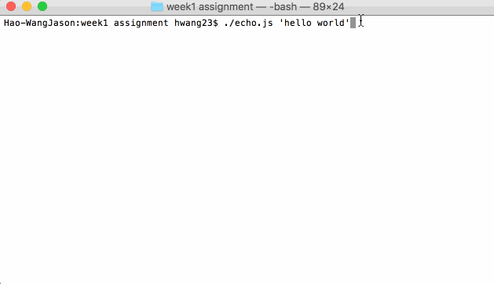

# node.js-week1-assginment

Time spent: [3 hrs]

Completed:

- [x] Required: `echo.js` prints the first argument to stdout
- [x] Required: `cat.js` prints the contents of the first argument to stdout
- [x] Required: `touch.js` updates the modified date of the first argument
- [x] Required: `ls.js` recursively lists the files of the first argument
- [x] Required: `mkdir.js` create a directory at the first argument
- [x] Required: `rm.js` deletes any file or directory at the first argument
- [x] Required: Install your CLIs globally
- [x] Optional: `grep.js` prints lines matching the first argument in the files matching the second argument

Walkthrough Gif:

